<p align="center"></p>

<h1 align="center">Cairn</h1>

<p align="center"><b>A Windows 11 optimizer that remembers everything it changes.</b></p>

Cairn tunes, cleans, checks and debloats Windows 11 from one dark, fast window, and it never
makes a change it cannot account for. Before any setting is touched, its original value is
written to a local journal, so every tweak, removed app, startup entry, DNS change, Windows
Update setting and scheduled task can be undone on its own from History, or all at once with
**Revert All Changes**. Things that cannot be undone (deleting files, running Windows' repair
tools, resetting the network stack, updating apps) are clearly marked, confirmed first and logged.

Like the stone cairns that mark a trail, it leaves a marker at every step so you can always find
your way back.

<p align="center">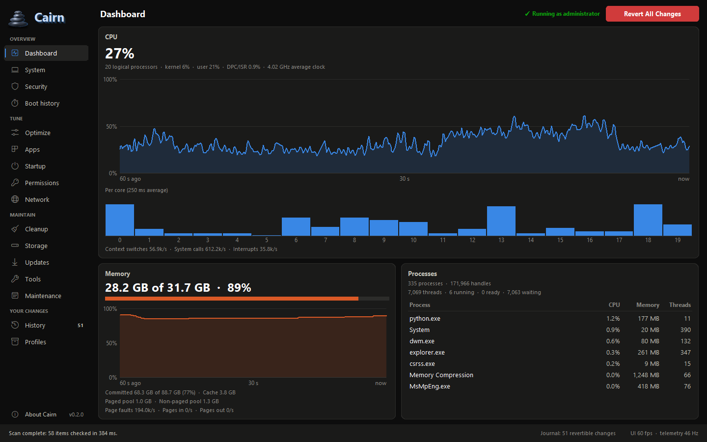</p>

## Features

Sixteen sections in four groups in the sidebar. In a narrow window the sidebar shrinks to icons;
Ctrl+Tab and Ctrl+Shift+Tab (or Ctrl+PgDn and Ctrl+PgUp) move between sections.

### Overview

- **Dashboard**: CPU (total, per core, clock, kernel/user/DPC time), memory (use, commit, pools, paging) and the top processes, redrawn at 60 fps from a native C++ sampler. Hover a chart or core bar for exact values.
- **System**: a read-only summary of the PC: Windows edition and build, processor, memory modules, graphics, displays, motherboard and firmware, storage and security (Secure Boot, TPM, virtualization, memory integrity). **Copy as text** leaves out the computer name.
- **Security**: a read-only checkup of 24 checks in six groups (virus and threat protection, firewall and network, Windows Update, device security, accounts and sign-in, apps and browser), scored from 0 to 100 and listed as *To fix*, *Could not check* and *Passed*. Fixes use Cairn's own undoable changes or open the right page of Settings, Windows Security or a built-in Windows tool. Drive encryption is checked only with administrator rights.
- **Boot history**: the last 30 full starts as a chart, read from Windows' Diagnostics-Performance log (Windows times only full starts, such as restarts; Fast Startup starts are counted in a note), the trend, what slowed starts down (apps, drivers, services, devices), shutdown times and **Turn off at startup** for slow apps that start with Windows. Windows lets only administrators read this log.

### Tune

- **Optimize**: 57 tweaks in four groups (privacy, gaming, performance and the Windows interface), including Office and Edge privacy policies, plus the modes Privacy Mode, Gaming Mode, Max Performance and Clean Interface. Each tweak shows its risk and whether it needs a restart, and each can be applied or undone on its own. A tweak for Office, Edge or GPU scheduling says *Not on this PC* when the product or the driver support is missing. Turning a mode on shows every change first; turning it off restores the recorded originals of that mode.
- **Apps**: removes built-in Store apps for your account. Removed apps can be put back from Apps or History.
- **Startup**: turns startup apps on and off the way Task Manager does.
- **Permissions**: a guide to which apps may use the camera, the microphone and your location. Windows 11 manages these permissions itself, in Settings › Privacy & security, and on this version of Windows an app like Cairn cannot change them, so Cairn has no switches for them. For each device a button opens its page in Settings, and a read-only list shows the desktop apps that used the device recently, as Windows records it.
- **Network**: adapters with their addresses and DNS servers. DNS servers can be set per adapter to a preset (Cloudflare, Google, Quad9 and their filtering variants) or to custom addresses; the change is recorded and can be undone on the adapter, from History or with Revert All. DNS changes are refused while a VPN is connected and on adapters whose DNS is set per Wi-Fi network in Windows Settings. **Flush DNS cache** and **Renew lease** are logged only. **Reset network stack** resets Winsock and TCP/IP, needs a restart and cannot be undone.

### Maintain

- **Cleanup**: sizes and deletes temporary files, Windows Update downloads, the Delivery Optimization cache, crash dumps, error reports, the thumbnail and GPU shader caches, the Chrome, Edge and Firefox caches and the Recycle Bin. In the temp folders, files changed in the last 24 hours are kept. Deleted files cannot be restored.
- **Storage**: a disk speed test in the style of CrystalDiskMark (sequential 1 MB and random 4 KB reads and writes at a deep and a shallow queue, the best of 1, 3 or 5 runs, with earlier results kept), a space analyzer (the folder tree and the largest files of a drive or folder) and a duplicate finder (same size, then same SHA-256 hash). Storage never deletes your files: it opens them in File Explorer, where you decide. The speed test writes one test file in an administrator-only folder at the root of the drive and deletes it afterwards.
- **Updates**: **App updates** checks for app updates with winget and updates the apps you select, or all of them; **Install apps** installs apps from a list you can edit and skips the ones already installed; **Windows Update** pauses updates for up to five weeks, sets active hours, skips drivers, delays feature updates and turns the restart notification on or off, each undoable. See [App updates with winget](#app-updates-with-winget) and [Windows Update settings](#windows-update-settings).
- **Tools**: Windows' own maintenance tools with live output: System File Checker (check, repair), DISM component store (check, scan, repair), Optimize drive, Retrim SSD and a read-only Check disk, plus a restore point button and shortcuts to built-in Windows tools. One tool runs at a time, in the background. Only Check disk can be stopped; the repairs keep running if the window is closed. Tool runs are logged, never journaled: repairs cannot be undone.
- **Maintenance**: a weekly scheduled task that cleans the locations you choose and runs two read-only checks (`sfc /verifyonly` and DISM CheckHealth). It never repairs anything, and it can be turned on only in an installed copy. See [Scheduled maintenance](#scheduled-maintenance).

### Your changes

- **History**: every active change with its own Undo button, and the activity log of everything Cairn did, including what cannot be undone. The sidebar shows how many changes are active.
- **Profiles**: the starter profiles Gaming, Privacy and Clean, and profile files, such as one made on another PC with **Export this PC's settings…**. A preview shows row by row what a profile would change on this PC; the rows you keep are applied in one recorded session, which **Undo these changes** reverts (when scheduled maintenance was already on, its changed schedule stays until you turn maintenance off). Rows with a caution, such as High-risk tweaks, turning on scheduled maintenance or delaying feature updates, start unchecked. A profile is a strict JSON file that cannot name paths, commands, services, tasks or server addresses; see [docs/profile-format.md](docs/profile-format.md).

**Revert All Changes** in the top bar restores everything Cairn recorded, from its journal: registry values, services, scheduled tasks, startup apps, Store apps, DNS servers, the power plan and the scheduled maintenance task. **About** (F1, or the last row of the sidebar) shows the versions, where this copy runs from and the data folder.

## Screenshots

| Dashboard | System |
|---|---|
|  | 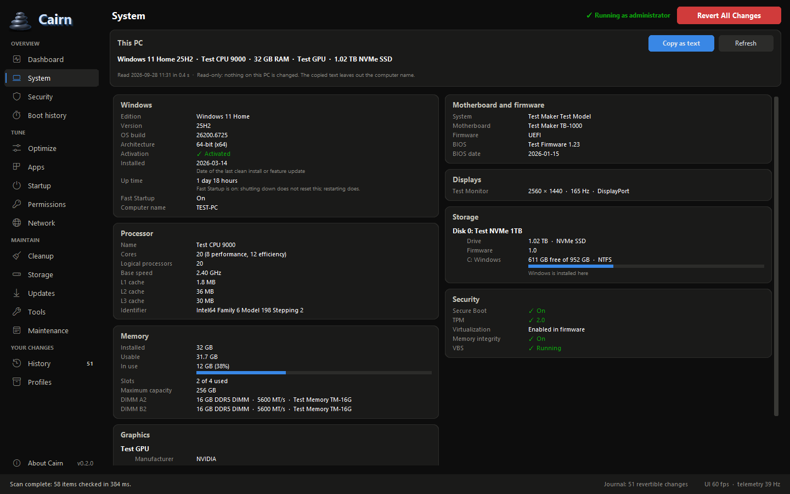 |
| **Security** | **Optimize** |
| 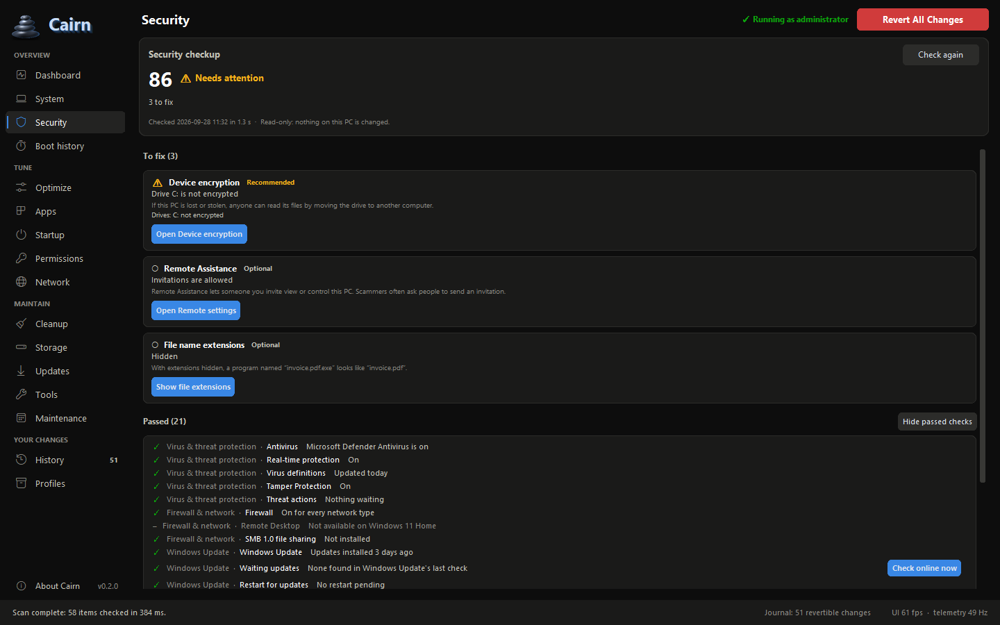 | 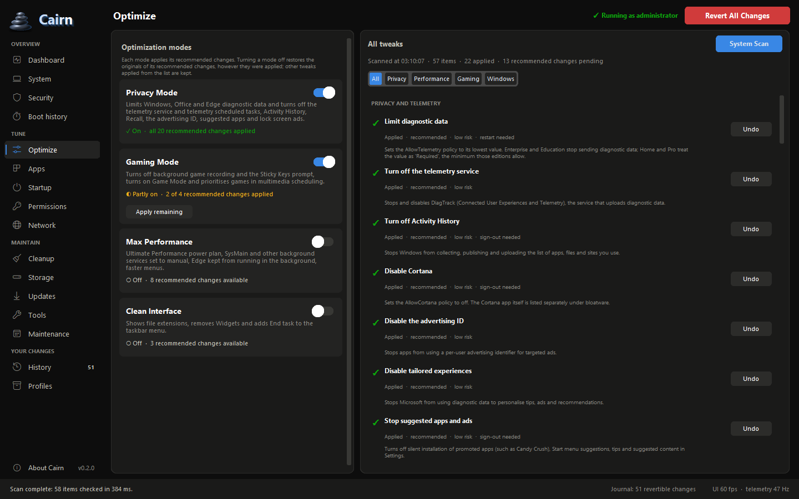 |
| **Network** | **Cleanup** |
| 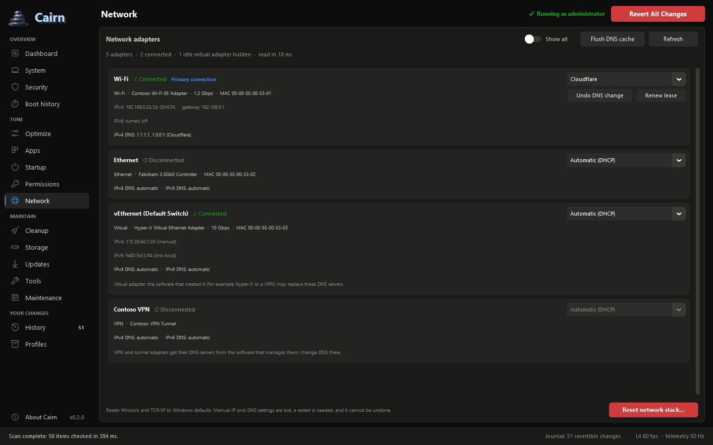 | 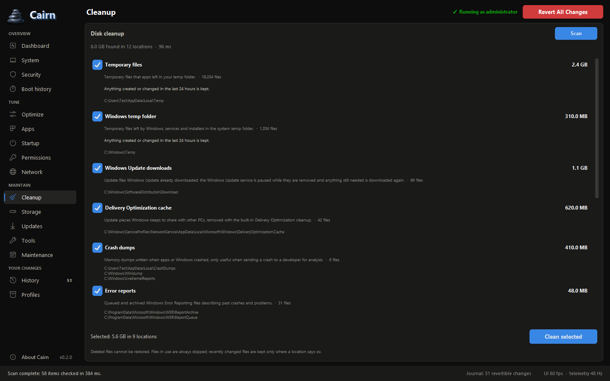 |
| **Storage** | **Updates** |
| 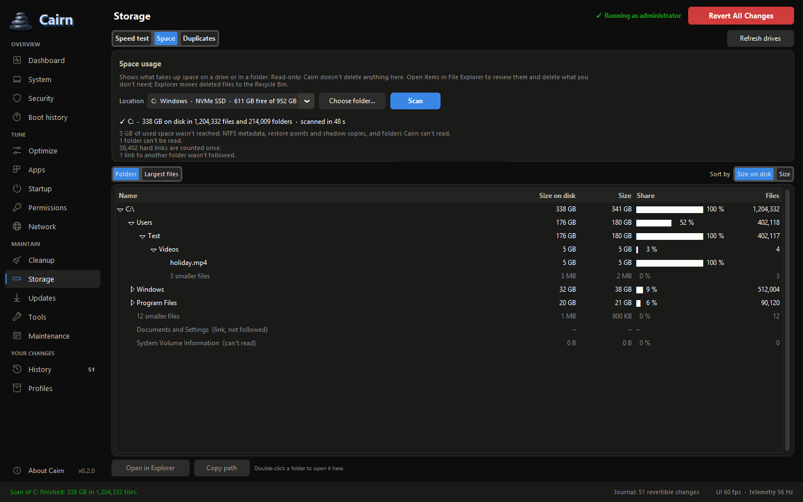 | 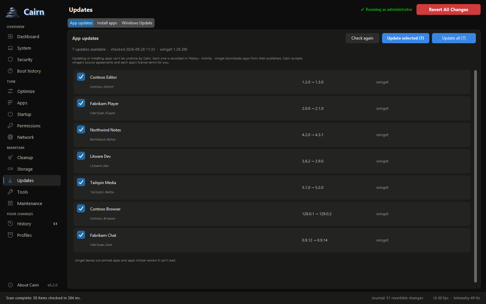 |
| **Tools** | **Maintenance** |
| 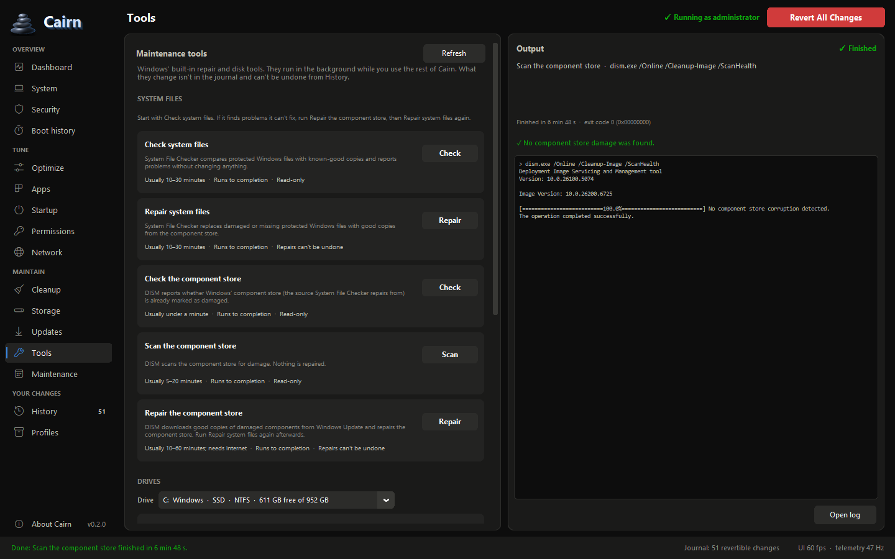 | 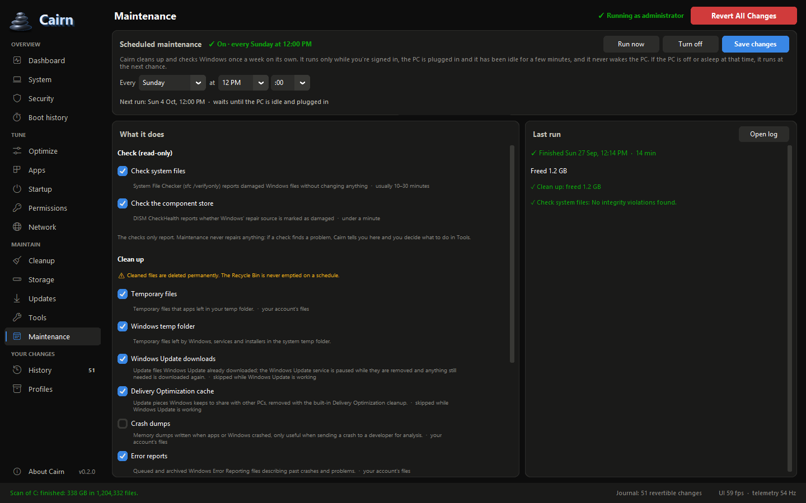 |
| **History** | **Profiles** |
| 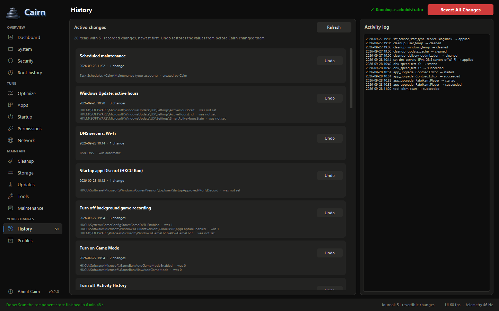 | 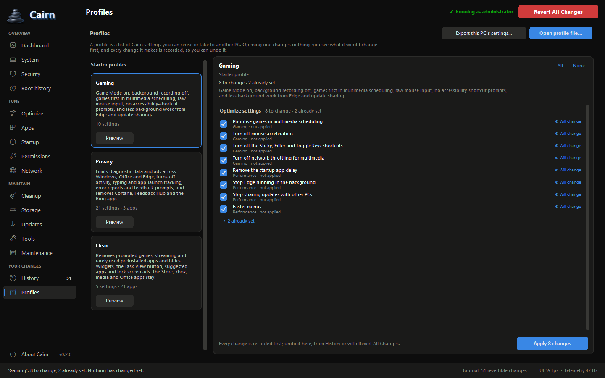 |

The pictures show the window running on the tests' fake engine with generic data; only the
Dashboard's charts and process list are live. To take them again, run
`.venv\Scripts\python.exe scripts\make_screenshots.py` from the repository root with the display
at 100 % scaling. In about a minute it shows every section on a separate desktop that is never
shown, so nothing appears on the screen, and it replaces the twelve pictures in
`docs\screenshots` only when every section was shown without an error. `--out <folder>` writes
them elsewhere, and `--visible` copies them from the screen instead, with the window on top of
everything else. Look at each picture before you commit it.

## How it keeps you safe

- **Journal first.** The original value of every setting is recorded in a local SQLite journal before anything is written. Undo restores exactly that value, even after reboots and updates.
- **Plan first.** Tweaks, modes, app removals, DNS changes, profiles, scheduled maintenance and Revert All show what they will change, and nothing happens until you confirm.
- **Restore point.** The first tweak, app removal or profile Cairn applies after it starts also asks Windows for a System Restore point, and so does every network stack reset; other changes rely on the journal alone.
- **Honest about the irreversible.** File deletion, repairs, network resets and app updates are labelled, confirmed and written to the activity log instead of being presented as undoable (see [What Cairn can't undo](#what-cairn-cant-undo)).
- **Your account only.** Per-user changes are refused when the window runs as a different account than the signed-in user, or when Cairn cannot confirm the account (see [Elevation and accounts](#elevation-and-accounts)).
- **Protected install folder.** The installed `Cairn.exe` asks for administrator rights, and scheduled maintenance can be turned on, only when the install folder can be changed by administrators alone.

## Install

**Requirements:** Windows 11, 64-bit (x64), and an administrator account for changes to Windows as a
whole. Without administrator rights Cairn monitors and reads, and makes only the few changes listed
under [Elevation and accounts](#elevation-and-accounts). The setup refuses Windows versions older
than Windows 11.

1. Get `Cairn-<version>-setup.exe` from the [Releases page](https://github.com/Dray973/Cairn/releases) once a release is published, or [build it yourself](#build-from-source). The build writes the setup's SHA-256 into `SHA256SUMS.txt` next to it.
2. Run it and approve the UAC prompt. It installs for all users into `C:\Program Files\Cairn`. There is no folder choice, because Cairn asks for administrator rights only from a folder that only administrators can change. It adds Cairn to the Start menu and, if you tick the box, to the desktop. Everything Cairn needs comes with it, including a private copy of Python 3.12 that only Cairn uses.
3. Start Cairn from the Start menu (see [Elevation and accounts](#elevation-and-accounts)).

**Upgrading:** run the newer setup. It asks you to close Cairn and, while a scheduled maintenance
run is in progress, to wait for it. A setup older than the installed version refuses to install.

**Uninstalling:** Settings › Apps › Installed apps › Cairn › Uninstall. When changes are still
recorded for your account, or the uninstaller cannot check, it warns you first: uninstalling leaves
those settings as Cairn set them, so use **Revert All Changes** before if you want them back. It
removes the program, its shortcuts, its entry in Installed apps and Cairn's scheduled maintenance
tasks, and nothing else: your change history and logs stay (see [Your data and logs](#your-data-and-logs)).

### SmartScreen and Smart App Control

Cairn's setup and programs are not code-signed yet, so Windows treats them as unknown:

- **Microsoft Defender SmartScreen** may show *Windows protected your PC* when you run the setup. Choose **More info**, then **Run anyway**, once you trust the file.
- **Smart App Control** (Windows Security › App & browser control) is stricter: while it is on, it can block unsigned programs and libraries outright (the setup, the installed Cairn and a development build alike), and it offers no exception for a single app.

## Elevation and accounts

- **Starting Cairn.** An administrator gets one UAC prompt when Cairn starts; a standard user starts without one. If you decline the prompt, Cairn opens without administrator rights and its top bar says so. Starting Cairn while it is open brings the open window to the front, without a prompt.
- **Without administrator rights** Cairn monitors and reads, and makes only changes that concern your account alone: per-user startup apps and flushing the DNS cache. It also checks for app updates, scans folders, finds duplicates, runs the security checkup and previews and exports profiles. Everything else asks for administrator rights first (**Restart as administrator** in the top bar). Undo asks for them only when the change it undoes needed them.
- **Another account.** When a standard user types an administrator's password into the UAC prompt, the window runs as that administrator, not as you. Cairn then shows *Administrator · another account* and refuses everything that would land in that other account: per-user tweaks and startup apps, Store apps, app updates and installs (the check included), and turning on or running scheduled maintenance. Changes to Windows as a whole (machine-wide tweaks, Windows Update settings, Tools) work as usual. Cairn treats an account it cannot confirm the same way.
- **Copies that aren't installed.** `Cairn.exe` asks for administrator rights only when its folder, the libraries it loads and every folder above them can be changed by administrators alone, as in `C:\Program Files\Cairn`. A copy anywhere else, such as the staged build in `build\dist\stage`, never asks; started normally, it runs without administrator rights and says *this copy isn't installed*.
- **Development copy.** The development copy is `python -m optimizer` from the virtual environment, started by the VS Code task `run: gui (Administrator)` or by `scripts\run_dev.ps1` (UAC prompt; `-Standard` starts without one). It shares the change history and the single-instance lock with an installed Cairn.
- **Command line.** `optctl.exe` always asks for administrator rights when it starts (its manifest requires them). `cairn-maintenance.exe` is started only by the scheduled maintenance task.
- With Windows 11's optional *Administrator protection*, elevated programs run as a separate, system-managed account. Cairn is expected to treat that as another account and leave your per-user settings alone; this is not tested yet.

## What Cairn can't undo

Some actions have no earlier state to go back to:

- deleting files, in Cleanup and in every scheduled maintenance run;
- Windows' repair and drive tools in Tools: the System File Checker and DISM repairs, Optimize drive, Retrim;
- network maintenance: Flush DNS cache, Renew lease, Reset network stack;
- updating and installing apps with winget;
- disk speed tests, and removing a test file a speed test left behind;
- **Run now** in Maintenance, and removing a maintenance task Cairn has no record of.

Cairn never offers these as undoable, and History's activity log records each one. The destructive
ones (Cleanup, the repairs, the network reset, app updates and installs, Run now, removing an
unrecorded task) ask first with a red confirm button and a message that says what can't be undone;
the network reset and app updates and installs also need a box ticked. Turning on scheduled
maintenance says that every run permanently deletes the files in the chosen locations.

Read-only features change no setting and add nothing to the activity log: the security checkup
(reading Windows Update's status can start the Windows Update service), boot history, the space
analyzer and duplicate search, the app update check, and profile previews and exports.

## App updates with winget

- Cairn drives the winget command line of App Installer (winget 1.6 or newer). It starts `winget.exe` by its full path in the App Installer package folder under `C:\Program Files\WindowsApps`, found through Windows' list of packages installed for your account, never through the `winget` alias in your user profile, which any program you run could replace. When App Installer is missing or too old, Updates says so and links to it in the Microsoft Store.
- winget gets an environment that Cairn builds from Windows itself, package ids are checked before they are passed, and flags such as `--force`, `--override` and `--allow-reboot` are never passed.
- Cairn passes `--accept-source-agreements` and `--accept-package-agreements`: updating or installing an app accepts winget's source agreements and the app's license terms on your behalf. The confirmation dialog says so.
- Apps are updated or installed one at a time, silently; **Stop after this app** ends a batch once the current app is done. Microsoft Store apps and apps that winget updates only when they are picked by name are not selected by default.
- Updates and installs can't be undone by Cairn. Each app gets a *started* row in History's activity log before winget starts and one row with its result. Remove apps in Settings › Apps.
- Cairn does not detect metered connections. On a metered or capped connection, check what an update will download before you start it.
- Checking for updates needs no administrator rights; updating and installing do. All of it is turned off while Cairn runs as another account than the signed-in user, because per-user installers would install into that account.

## Windows Update settings

**Updates › Windows Update** changes five settings. Each one is recorded first and can be undone
there, in History or with Revert All:

| Setting | What it does | Editions |
|---|---|---|
| Pause updates | no updates for one to five weeks; security updates wait too | all |
| Active hours | no restarts for updates during these hours (at most 18), or automatic | all |
| Skip drivers in Windows Update | quality updates leave out device drivers (a policy) | documented for Pro and higher; Home may ignore it |
| Delay feature updates | a new Windows version is offered only a chosen number of days (up to 365) after its release (a policy) | Pro and higher; not offered on Home |
| Notify me before restarting | a notification when Windows needs to restart to finish updating | all |

Pause, active hours and the restart notification are the values the Settings app writes. On
Windows 11 Home a new Windows version installs only when you choose it in Settings, until your
current version nears the end of its support, so Cairn does not offer the delay there. Because the
other two are policies, Windows Settings says some settings are managed by your organization while
they are set. Settings that an organization manages (an update server, or policies that turn off
pausing or set active hours) carry a note and are left alone. Changing these settings needs
administrator rights; they belong to the whole PC, so they also work when Cairn runs as another
account.

The security checkup reads Windows Update's status, which can start the Windows Update service, and
looks for waiting updates in Windows Update's own cached data. It searches online only when you
choose **Check online now**.

## Scheduled maintenance

**Maintenance › Turn on** adds one weekly task to Windows Task Scheduler,
`\Cairn\Maintenance-<your account's SID>` (Sunday at 12:00 unless you choose another time). Each run:

- permanently deletes the files in the cleanup locations you chose (by default temporary files, Windows Update downloads, the Delivery Optimization cache and error reports; never the Recycle Bin);
- runs `sfc /verifyonly` and DISM CheckHealth if you chose them (both are on by default). Both only report: maintenance never repairs anything, and if a check finds a problem, Maintenance tells you and you decide what to do in Tools.

The task runs `cairn-maintenance.exe` as your account with administrator rights, only while you
are signed in and the PC is plugged in and idle. It never wakes the PC; a run that was missed starts
at the next chance. **Run now** starts it at once, and it keeps running if you close Cairn. Results
appear in Maintenance (the last run, earlier runs and a ⚠ in the sidebar when a run needs
attention) and in History's activity log, and each run writes a transcript into the `maintenance`
folder of the data folder. **Turn off**, Undo in History and Revert All delete the task.

Turning it on needs:

- **an installed copy.** The program the task runs, the libraries it loads and every folder above them must be changeable by administrators alone, as in `C:\Program Files\Cairn`: a task with administrator rights must not run a program that other programs could replace. A development build is refused for that reason.
- **administrator rights, as your own account**, which must be an administrator. Microsoft Entra ID (work or school) accounts are not supported.

If another program holds Cairn's maintenance lock, scheduled runs are skipped and Maintenance says
so. The uninstaller removes the maintenance tasks of every account on the PC.

## Your data and logs

Cairn keeps its data per Windows account in `%LOCALAPPDATA%\PCOptimizer` (the project's former
name; renaming the folder would need a migration for every account):

| Path | What it holds |
|---|---|
| `journal.db` | the journal: the original value of every change, the activity log and the maintenance runs (SQLite) |
| `logs\cairn.log`, `logs\native.log` | the window's log and the engine's output, from the first interactive start on |
| `tools\` | logs of the Tools runs |
| `jobs\winget\` | transcripts of the winget checks, updates and installs |
| `maintenance\` | transcripts of the scheduled maintenance runs |
| `storage\speed_history.json` | earlier speed test results |
| `app_list.json` | your list in Install apps, once you change it |

- Logs and transcripts can contain your Windows user name inside the paths they mention (your profile folder's path, for example). Look through them before you share them.
- Uninstalling keeps this folder: the journal is the only way to undo changes that are still applied. After **Revert All Changes**, or when nothing needs undoing, you may delete the folder by hand.
- **About** shows the folder and opens it.
- The installed Cairn always uses this folder. A development run and `optctl` use `%OPTIMIZER_DATA_DIR%` instead when that variable is set, and `optctl --journal <path>` names a journal directly.

**Journal schema.** Cairn 0.2.0 writes journal schema 5, which adds the scheduled maintenance task
and its runs. It upgrades an older journal the first time it opens it and never lowers the version.
A Cairn that finds a journal written by a newer version refuses to use it and leaves it untouched
(*This change history was written by a newer version of Cairn… Update Cairn to use it; nothing was
changed.*), and the setup refuses to install an older Cairn over a newer one. Cairn 0.1 predates
this check: don't run a 0.1 build against a journal that 0.2.0 has opened.

## Build from source

### Prerequisites

- Windows 11 x64
- Visual Studio 2022 or its Build Tools, with the C++ workload (MSVC v143 x64 and the Windows 11 SDK)
- CMake 3.24 or newer
- Python 3.12 x64 from python.org, with the `py` launcher; the release build copies this runtime, Tcl/Tk included, into the installed copy
- Rust through rustup: the stable MSVC toolchain with clippy and rustfmt (`rust-toolchain.toml` selects it) and, for the release checks, Rust 1.80 (`rustup toolchain install 1.80`)
- Git
- Inno Setup 6.3 or newer for the setup program (`winget install JRSoftware.InnoSetup`)

`scripts\bootstrap.ps1` installs everything but Inno Setup and Rust 1.80 with winget (run it from an
elevated PowerShell); `scripts\check_env.ps1` checks the build tools.

### Release build and setup, without VS Code

```powershell
git clone https://github.com/Dray973/Cairn
cd Cairn
py -3.12 -m venv .venv
.\.venv\Scripts\python.exe -m pip install -r requirements.txt
powershell -ExecutionPolicy Bypass -File .\scripts\build_release.ps1
```

`scripts\build_release.ps1`:

1. checks that `Cargo.toml`, `ui\pyproject.toml` and `ui\optimizer\__init__.py` carry the same version;
2. runs the checks, unless `-SkipChecks`: rustfmt, clippy, the Rust 1.80 check, the Rust tests, ruff and the UI tests;
3. builds the telemetry DLL without AVX2, and `Cairn.exe`, `optctl.exe`, `cairn-maintenance.exe` and the engine for x86-64-v2, with the build machine's folders removed from the paths embedded in them;
4. stages `build\dist\stage`: the programs, a private copy of the Python 3.12 runtime, the app, the four packages of `requirements-runtime.txt` (pinned with hashes; pip downloads them from PyPI), the licenses and compiled bytecode;
5. checks the stage: `Cairn.exe --check` and `Cairn.exe --self-test` (both read-only; the self-test runs with Tcl variables set that the launcher must remove) must pass, and no staged file may be a PDB or contain the path of the repository or of the user profile;
6. with Inno Setup installed, writes `build\dist\Cairn-<version>-setup.exe`, `SHA256SUMS.txt` and `Cairn-<version>-symbols.zip` (the PDBs, not shipped).

`-SkipChecks` skips step 2 and `-StageOnly` stops after step 5. Apart from pip's and cargo's
download caches, the script writes only under `build\` and `target\dist`, and, unless `-SkipChecks`,
what the checks of step 2 write like any test run: cargo's `target\` folder, tool caches in `ui\`,
temporary folders under `%TEMP%` and the registry sandbox `HKCU\Software\PCOptimizer\SelfTest` (see
[Tests](#tests)). It never installs anything on the PC and never asks for administrator rights. The
staged `Cairn.exe` runs from a folder you can change, so it never elevates: use it for checks, and
install the setup to use Cairn. The VS Code tasks `release: build installer` and
`release: stage only` (`-StageOnly -SkipChecks`) run the same script.

### Development build

In VS Code: Terminal › Run Task › `env: bootstrap toolchains (winget)` once (UAC prompt), restart VS
Code, then `Ctrl+Shift+B` (`build: all`: venv, C++ DLL, Rust workspace, deploy natives) and Run Task
› `run: gui (Administrator)`. Without VS Code:

```powershell
py -3.12 -m venv .venv; .\.venv\Scripts\python.exe -m pip install -r requirements.txt
cmake -S . -B build\cpp -G "Visual Studio 17 2022" -A x64
cmake --build build\cpp --config Release --parallel
$env:PYO3_PYTHON = "$PWD\.venv\Scripts\python.exe"; cargo build --release --workspace
.\scripts\deploy_natives.ps1 -Config Release
.\scripts\run_dev.ps1            # UAC prompt; -Standard starts without administrator rights
```

Development builds target x86-64-v3 (AVX2, set in `.cargo\config.toml`) and build the telemetry DLL
with AVX2 (CMake option `TEL_AVX2`, on by default); the release build uses x86-64-v2 and no AVX2. A
development copy cannot turn on scheduled maintenance, because its folder is not administrator-only.

## Tests

```powershell
$env:PYO3_PYTHON = "$PWD\.venv\Scripts\python.exe"
cargo test --workspace                                   # Rust
.\build\cpp\bin\Release\telemetry_smoke.exe              # C++ telemetry kernel
.\scripts\pytest_serial.ps1 tests -q                     # Python bridges and window
```

Tests never change the live system. Mutations run against fakes, temporary journals and the
registry sandbox `HKCU\Software\PCOptimizer\SelfTest`. A few tests marked `#[ignore]` reach Windows
itself (a throwaway service, scheduled tasks under `\PCOptimizerSelfTest\`, an administrator-only
folder inside a temporary folder, Windows Update's status); they run only when named, and most of
them need an elevated shell.

**Guards.** `.cargo\config.toml` sets four variables to `1` for every cargo test and `cargo run`, and
`ui\tests\conftest.py` and `scripts\pytest_serial.ps1` set them for pytest. While a variable is `1`,
the engine refuses:

| Variable | Refused |
|---|---|
| `OPTIMIZER_FORBID_RESTORE_POINT` | creating a System Restore point |
| `OPTIMIZER_FORBID_DRIVE_TESTS` | a disk speed test, or removing a speed test's leftovers, at the root of a drive |
| `OPTIMIZER_FORBID_UPDATE_SEARCH` | searching Windows Update |
| `OPTIMIZER_FORBID_APP_INSTALLS` | updating or installing apps with winget |

Set them yourself to try a development build without these actions. `pytest_serial.ps1` puts back
the caller's values (or their absence) when it ends, so an app started later from the same terminal
behaves as before.

**Test data folder.** `.cargo\config.toml` also sets `OPTIMIZER_DATA_DIR` to `target\test-data`, so
`cargo test` and `cargo run` use a journal and logs there, never your real data folder, unless
`OPTIMIZER_DATA_DIR` is already set (cargo doesn't override it). pytest points it at a new
`cairn-pytest-*` temporary folder before the engine loads and deletes that folder at the end.
`pytest_serial.ps1` runs one UI test run at a time, and the test windows open on a separate desktop
that is never shown (`OPTIMIZER_SHOW_TEST_WINDOWS=1` shows them).

## Command line

`optctl.exe` (next to `Cairn.exe` in an installed copy, `target\release\optctl.exe` in a build)
mirrors the window:

- `doctor`, `sysinfo`, `catalog`, `scan`, `apply`, `revert`, `rollback`, `restore-point` and `journal` (`summary`, `list`, `export`, `pending`)
- `net` (`list`, `presets`, `dns`, `flush-dns`, `renew`, `reset`) and `tools` (`list`, `run`)
- `health` (`security`, `boots`), `perm list` (the Settings pages of the app permissions and the desktop apps that used each device; `perm set` refuses every change) and `storage` (`volumes`, `speed`, `history`, `leftovers`, `scan`, `duplicates`)
- `updates` (`status`, `list`, `upgrade`, `install`, `apps`, `wu`, `wu-set`, `wu-undo`), `maintenance` (`status`, `enable`, `disable`, `run-now`, `run`, `runs`) and `profile` (`starters`, `show`, `plan`, `apply`, `export`)
- the read-only probes `reg-get`, `svc-get` and `task-get`

Every command that changes something prints its plan and stops unless `--yes` is given, and
`--dry-run` only plans; `restore-point` and `net flush-dns` act at once.

## Layout

```
Cairn/
├── .vscode/
│   ├── tasks.json            build: all (Ctrl+Shift+B) → venv → C++ DLL → cargo → deploy; run: gui (Administrator);
│   │                         release: build installer, release: stage only, run: staged Cairn
│   ├── launch.json           debugpy (GUI), cppvsdbg (optctl.exe, DLL under python host), attach configs
│   ├── settings.json         interpreter, rust-analyzer, CMake generator
│   └── extensions.json
├── .cargo/config.toml        x86-64-v3 for development builds, MSVC linker, test guards and test data folder
├── Cargo.toml                workspace root: version, shared deps, release profile (fat LTO)
├── rust-toolchain.toml       stable-x86_64-pc-windows-msvc
├── CMakeLists.txt            root CMake (C++20, static CRT, adds telemetry/)
├── requirements.txt          development packages: the runtime pins plus requirements-dev.txt
├── requirements-runtime.txt  the installed copy's packages, pinned with hashes
├── crates/
│   ├── core/                 optimizer_core   (rlib)  safety/ (journal, rollback), win/, debloat/, cleanup/,
│   │                                                  startup/, network/, tools/, sysinfo/, jobs/, health/,
│   │                                                  permissions/, storage/, updates/, maintenance/, profiles/
│   ├── pybridge/             optimizer_engine (cdylib → .pyd via PyO3 abi3)
│   ├── cli/                  optctl.exe and cairn-maintenance.exe (embedded requireAdministrator manifest)
│   └── launcher/             Cairn.exe: starts the embedded Python runtime and decides elevation
├── telemetry/
│   ├── CMakeLists.txt        optimizer_telemetry.dll (/O2 /GL, /arch:AVX2 unless TEL_AVX2=OFF, links powrprof + pdh)
│   ├── include/telemetry/    telemetry.h (extern "C" ABI), ntinternal.h
│   ├── src/                  telemetry.cpp, cpu.cpp, memory.cpp, process.cpp, sampler.h
│   └── tests/smoke.cpp       smoke test (ABI, accuracy, latency, leaks, threads)
├── ui/
│   ├── pyproject.toml        ruff + pytest config
│   ├── optimizer/
│   │   ├── __main__.py       python -m optimizer (--check and --self-test: read-only checks)
│   │   ├── app.py            main window: sidebar, top bar, 60 Hz frame loop, confirm-then-run flows
│   │   ├── sections.py       the sidebar's sections and groups
│   │   ├── system.py         elevation, relaunch as administrator, process helpers, timer resolution
│   │   ├── instance.py       one window per session; a second start brings it to the front
│   │   ├── logsetup.py       cairn.log and native.log
│   │   ├── theme.py          colour and type tokens
│   │   ├── bridge/           telemetry.py (ctypes → DLL), engine.py (worker thread → PyO3)
│   │   ├── features/         one mixin of the main window per area
│   │   ├── widgets/          the sections' panels, sidebar, charts, dialogs
│   │   └── native/           optimizer_telemetry.dll + optimizer_engine.pyd (deployed by build)
│   └── tests/                pytest suite; a fake engine stands in for every change
├── installer/cairn.iss       Inno Setup script of the setup program
├── scripts/
│   ├── bootstrap.ps1         one-time winget toolchain install (elevated)
│   ├── check_env.ps1         pre-build prerequisite check
│   ├── build_release.ps1     release build, staged app and setup program
│   ├── deploy_natives.ps1    copies DLL/.pyd into ui/optimizer/native
│   ├── run_dev.ps1           starts the development copy
│   ├── pytest_serial.ps1     runs the UI tests one run at a time, with the test guards set
│   ├── live_state_snapshot.ps1  read-only JSON snapshot of the settings Cairn can change
│   ├── make_icon.py          draws the icon and the README logo
│   ├── make_screenshots.py   takes the README screenshots with the tests' fake engine
│   ├── check_public.py       checks the working tree for personal data and this PC's identifiers
│   ├── verify_safety_layer.ps1  elevated journal + restore point check
│   └── verify_debloat.ps1    elevated engine check (throwaway service, dry runs)
└── docs/                     logo, screenshots, profile-format.md
```

## License and disclaimer

Cairn is released under the [MIT License](LICENSE). The installed copy also carries the licenses of
Python, Tcl/Tk and its Python packages in its `licenses` folder.

Cairn changes Windows settings, services, scheduled tasks and apps. It records what it changes so it
can put it back, but it cannot undo what it labels irreversible, and Windows updates or other
programs can change the same settings in the meantime. Use it at your own risk; a restore point or a
backup before large changes is a good idea. Cairn is a personal project, not affiliated with or
endorsed by Microsoft, and comes without warranty of any kind.
